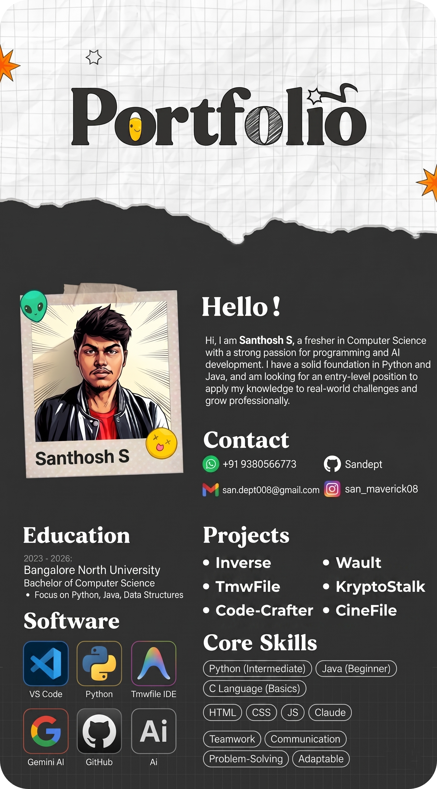

---

# 😎 About Me

 

 

<picture>
  <source media="(prefers-color-scheme: dark)" srcset="https://raw.githubusercontent.com/Sandept/About-me/output/github-snake-dark.svg" />
  <source media="(prefers-color-scheme: light)" srcset="https://raw.githubusercontent.com/Sandept/About-me/output/github-snake.svg" />
  
</picture>

---

# 🛠️ Tech Stack & Tools

### 👨‍💻 Languages
 

  

### 🎨 Design & Creative
 

  

  

### ⚙️ Tools & Platforms
 

  

  

---

# 📊 GitHub Analytics

  

---

# 🌐 Let's Connect

&nbsp;&nbsp;

  

&nbsp;&nbsp;

&nbsp;&nbsp;

 

 

